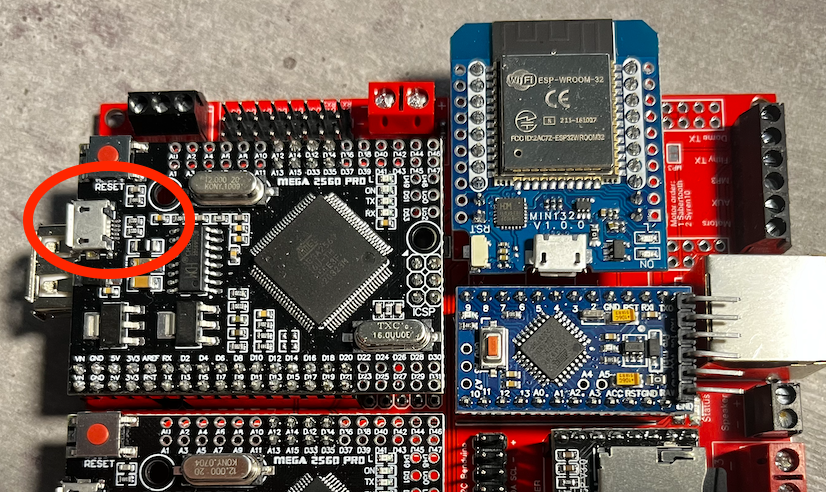
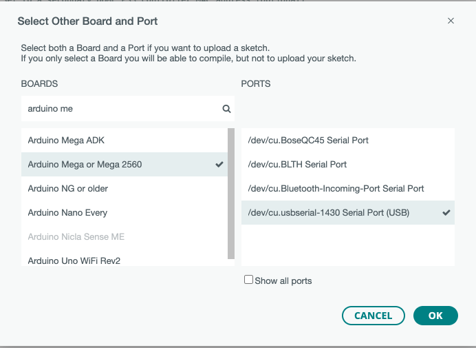

# How to pair PS3 Move Navigation
These instructions will guide you through the pairing of your 2 PS3 Move Navigation controller to your Astrocomms board.

I do assume some experience with ArduinoIDE ...

1. Connect the USB Bluetooth Dongle to the USB Host Shield

2. Connect the Astrocomms to your computer, via the Micro-USB port of the Arduino Mega 2560 with the USB Shield. 


3. Add the needed [Arduino Libraries](https://www.printed-droid.com/wp-content/uploads/2020/01/SHADOW_MD_Arduino_Libraries.zip) to your local Arduino IDE, by extracting the zip file to the right location.

4. Upload the [SHADOW (MD) Sketch](https://www.printed-droid.com/wp-content/uploads/2020/01/SHADOW_MD_Sketch_.zip) to your Arduino board.

5. Use a serial monitor tool like the one provided in Arduino IDE. Select the right Board, being *Arduiono Mega or Mega 2560* and the correct Port with a baud rate of *115200*


6. Optional (but recommended): make sure that serial debugging is enabled in the source code of the USB_Host_Shield library. To do so, check for `#ENABLE_UHS_DEBUGGING 1` in settings.h, as it should be.

7. After initialization, if Debugging is enabled, the Serial Monitor should display the following:
```
PS3 Bluetooth Library Started
Bluetooth Dongle Inititialized
HCI Reset complete
Local Bluetooth Address: ##:##:##:##:##:##
Wait For Incoming Connection Request
``` 

8. Unplug the Bluetooth Dongle and connect the PS3 Move Navigation via USB Cable to the USB port that previously had the Bluetooth Dongle.

9. This step will partly pair the PS3 Move Navigation  to the Bluetooth Dongle, so look for the following on the Serial Monitor, with the MAC Address being the same as the one of the Dongle.
```
Navigation Controller Connected
Bluetooth Address was set to: ##:##:##:##:##:##
```

10. Disconnect the PS3 Move Navigation via the USB Cable and re-insert the Bluetooth Dongle.

11. Power on the PS3 Move Navigation and look for the following messages on the Serial Monitor, this time the MAC Address should be something new.
```
Gamepad is connecting
Incoming Connection Request
Remote Name: Navigation Controller
Connected to Device: ##:##:##:##:##:##
```

12. Copy the BT Address of the controller, and paste it into the sketch *Shadow_MD_DualController_Template.ino* as the MAC Address to control the Foot/Body
```
String PS3ControllerFootMac = "##:##:##:##:##:##";
```

13. Repeat steps 8 to 12 to identify the MAC Address of the second PS3 Move Navigation and paste it into the variable for the MAC Address of the Dome
```
String PS3ControllerDomeMac = "##:##:##:##:##:##";
```

14. Compile and upload the altered *Shadow_MD_DualController_Template.ino* sketch to the Arduino Mega

15. When powering on both PS3 Move Navigation, you should see the following messages on the Serial Monitor
```
We have our FOOT controller connected.
...
We have our DOME controller connected.
```

