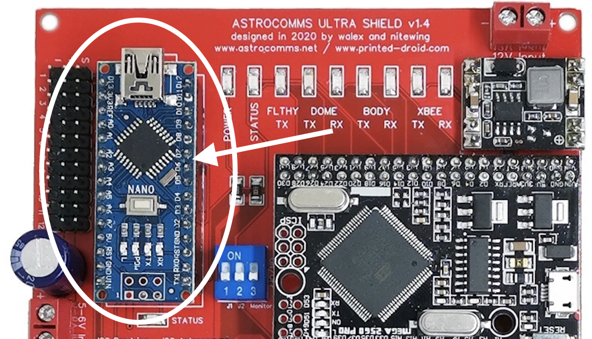
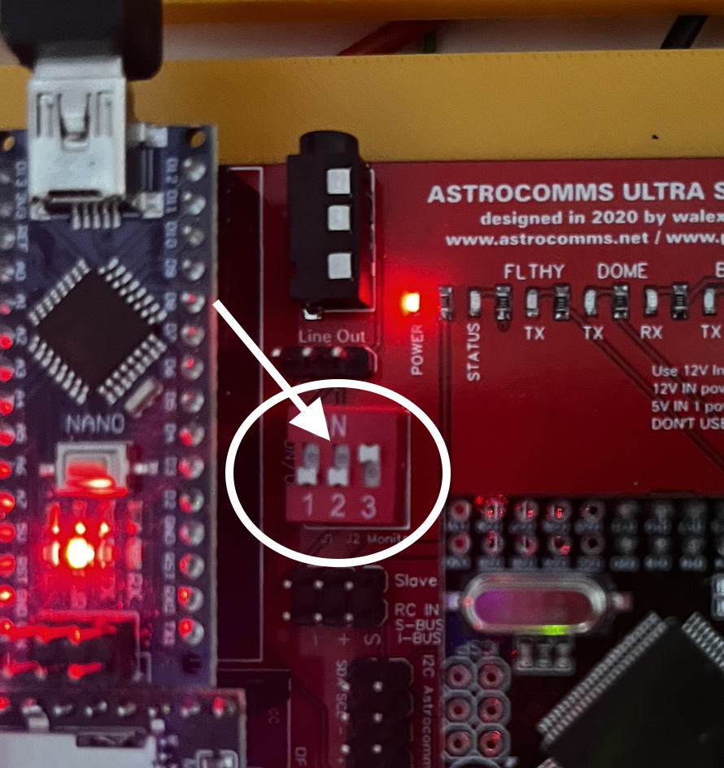

# Servo Settings
You will need to change some settings for your Servos, maybe the "open" or "close" position or the speed with which a Servo will move from one to the other.

## Body Servos
The Body Servos, like the ones to open/close the Utility Arms, etc are managed via the Arduino Nano of the Astrocomms Ultra Board and connected via the related Pins.

### Connecting to the Arduino Nano
Please always also read through the documentated provided by [Printed-Droid](http://printed-droid.com), in this case especially the documentation of the [Benduino Body Master for AstroComms Ultra](https://www.printed-droid.com/wp-content/uploads/2020/01/Benduino-Body-Master-for-AstroComms-Ultra-User-Manual.pdf).

To be able to interact with the Arduino Nano, you will have to connect it with your computer via the USB Port of the Arduino Nano and a Serial Monitor ( Arduino IDE ). A UART connector is not required.

Before physically connecting the Arduino with your computer, please make sure that the DIP-Switches are set to the correct position, being 1 & 2 to "off" and 3 remains on "on". 

Although the official instructions states to change the DIP Switches when flashing a new firmware, it is also needed to write any data to the Arduino Nano.

Please also make sure that you change the Baud-Rate of the Serial Monitor to 9600 Baud and to add "Carriage Return"

Don't forget to change back the DIP-Switches to their original state "1", "2" and "3" to "On" otherwise you will not be able to operate your servos via your controller or the App.

